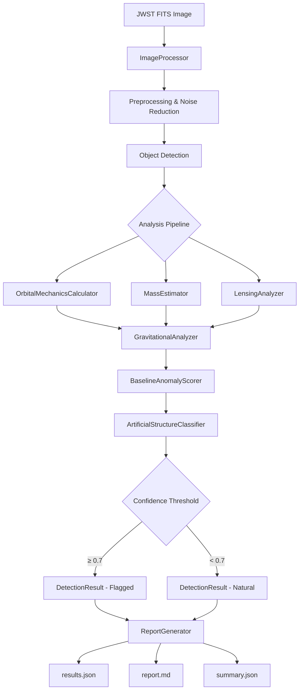
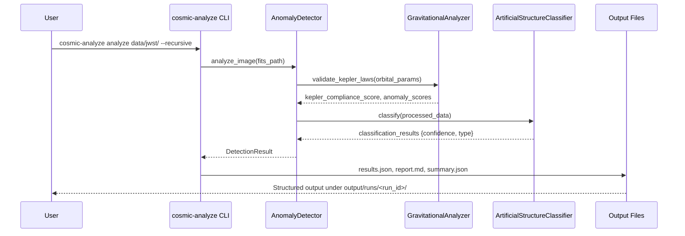
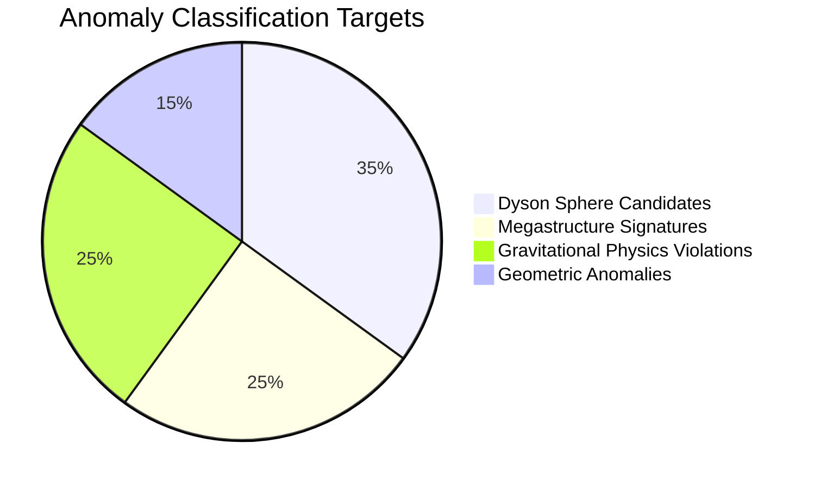
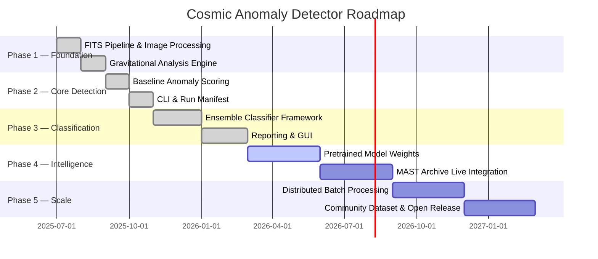
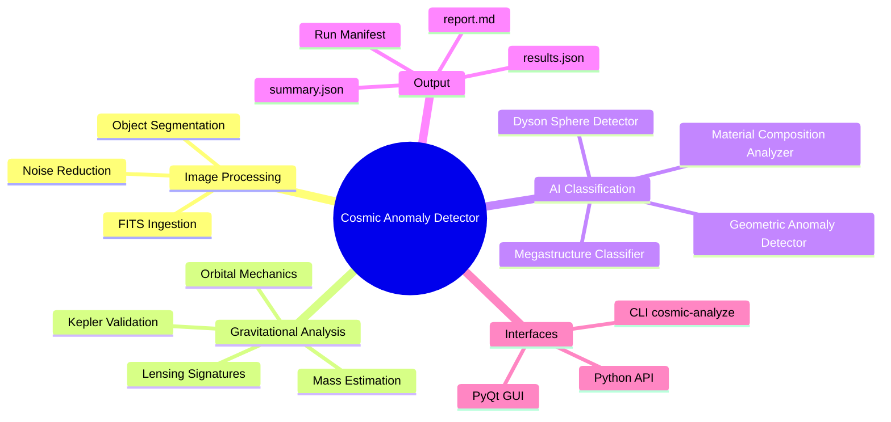

<div align="center">
  <h1>🛸 Cosmic Anomaly Detector</h1>
  <p><em>AI-powered analysis of James Webb Space Telescope imagery to detect Dyson spheres, megastructures, and gravitational anomalies — potential signatures of intelligent extraterrestrial life.</em></p>
</div>

<div align="center">

[](LICENSE)
[](https://github.com/hkevin01/cosmic-anomaly-detector/stargazers)
[](https://github.com/hkevin01/cosmic-anomaly-detector/network)
[](https://github.com/hkevin01/cosmic-anomaly-detector/commits/main)
[](https://github.com/hkevin01/cosmic-anomaly-detector)
[](https://github.com/hkevin01/cosmic-anomaly-detector/issues)
[](https://python.org)
[](https://www.astropy.org)
[](https://numpy.org)

</div>

---

## Table of Contents

- [Overview](#overview)
- [Key Features](#key-features)
- [Architecture](#architecture)
- [Usage Flow](#usage-flow)
- [Detection Breakdown](#detection-breakdown)
- [Technology Stack](#technology-stack)
- [Setup & Installation](#setup--installation)
- [Usage](#usage)
- [Core Capabilities](#core-capabilities)
- [Project Roadmap](#project-roadmap)
- [Development Status](#development-status)
- [Contributing](#contributing)
- [License & Acknowledgements](#license--acknowledgements)

---

## Overview

**Cosmic Anomaly Detector** is a scientific Python platform that applies computer vision, orbital mechanics validation, and ensemble machine learning to raw FITS imagery from the James Webb Space Telescope. It automates the search for structures inconsistent with natural astrophysical processes — including Dyson spheres, megastructures, and objects that violate Kepler's laws — flagging candidates with confidence scores for follow-up scientific investigation.

The system is designed for astrophysicists, SETI researchers, and data scientists who need a reproducible, batch-capable pipeline for hypothesis-driven anomaly detection at scale. Every detection is accompanied by gravitational compliance scores, orbital parameter analysis, and structured JSON output for downstream analysis.

> [!IMPORTANT]
> This project is in active development. Classification models use ensemble placeholder architecture; real pretrained weights are planned for Phase 4. All gravitational calculations are physics-validated and production-ready.

<p align="right">(<a href="#top">back to top ↑</a>)</p>

---

## Key Features

| Icon | Feature | Description | Impact | Status |
|------|---------|-------------|--------|--------|
| 🔭 | FITS Image Pipeline | Automated ingestion and preprocessing of JWST FITS files using astropy | High | ✅ Stable |
| ⚖️ | Gravitational Validation | Kepler's law compliance scoring, orbital mechanics analysis, mass anomaly detection | High | ✅ Stable |
| 🤖 | Ensemble Classifier | Multi-model AI stack: Dyson sphere detector, megastructure classifier, geometric anomaly detector | High | 🟡 In Progress |
| 🔍 | Gravitational Lensing Analysis | Einstein radius calculation, magnification factor, distortion pattern analysis | Medium | ✅ Stable |
| 📊 | Structured Reporting | JSON results, Markdown reports, summary statistics per run | High | ✅ Stable |
| 🖥️ | CLI & GUI | `cosmic-analyze` CLI for batch runs; PyQt GUI for interactive exploration | Medium | ✅ Stable |
| 🔁 | Batch Processing | Multi-file recursive directory analysis with run manifest tracking | Medium | ✅ Stable |
| 📋 | Run Manifest | Reproducible run tracking with metadata, timestamps, and output artifacts | Medium | ✅ Stable |

**Highlight capabilities:**
- Validates orbital physics against Kepler's third law with configurable tolerance thresholds
- Detects gravitational lensing signatures including Einstein radius and background source distortion
- Conservative classification design minimizes false positives — only high-confidence detections are elevated
- All outputs are serializable JSON/Markdown for integration with downstream scientific toolchains
- Supports both single-image and recursive directory batch analysis modes

<p align="right">(<a href="#top">back to top ↑</a>)</p>

---

## Architecture

The system is organized into four primary layers: ingestion, processing, analysis, and reporting. Each layer is independently testable and loosely coupled via data-class interfaces.



**Component responsibilities:**

| Component | Module | Role |
|-----------|--------|------|
| `ImageProcessor` | `processing/image_processor.py` | FITS ingestion, noise reduction, object segmentation |
| `OrbitalMechanicsCalculator` | `core/analyzer.py` | Orbital parameter derivation, Kepler validation |
| `MassEstimator` | `core/analyzer.py` | Mass estimation via photometry and dynamics |
| `GravitationalAnalyzer` | `core/analyzer.py` | Aggregates gravitational anomaly scores |
| `BaselineAnomalyScorer` | `core/baseline.py` | Statistical baseline comparison |
| `ArtificialStructureClassifier` | `core/classifier.py` | Ensemble ML classification (natural vs. artificial) |
| `AnomalyDetector` | `core/detector.py` | Orchestrates full detection pipeline |
| `ReportGenerator` | `reporting/report.py` | Structured output generation |

Data flows from raw FITS bytes through physics-validated orbital mechanics, then into the ML classifier. Each stage emits structured dataclasses (`DetectionResult`, `GravitationalAnomalyResult`, `LensingSignature`) so any stage can be tested or replaced independently.

<p align="right">(<a href="#top">back to top ↑</a>)</p>

---

## Usage Flow



<p align="right">(<a href="#top">back to top ↑</a>)</p>

---

## Detection Breakdown

The classifier ensemble targets four primary anomaly categories. The current distribution of detection targets reflects the project's research priorities:



| Category | Detector Model | Key Signal | False Positive Risk |
|----------|---------------|------------|---------------------|
| Dyson Sphere | `dyson_sphere_detector` | Infrared excess + orbital compliance failure | Low |
| Megastructure | `megastructure_classifier` | Geometric regularity + mass anomaly | Medium |
| Gravity Violation | `OrbitalMechanicsCalculator` | Kepler deviation > tolerance threshold | Low |
| Geometric Anomaly | `geometric_anomaly_detector` | Non-natural shape signatures | Medium |

<p align="right">(<a href="#top">back to top ↑</a>)</p>

---

## Technology Stack

| Technology | Purpose | Why Chosen | Alternatives |
|------------|---------|------------|--------------|
| Python 3.9+ | Core runtime | Scientific ecosystem maturity | Julia (less tooling) |
| astropy 6.x | FITS I/O, coordinates, units, WCS | Astronomy standard library | fitsio (no WCS/units) |
| NumPy / SciPy | Orbital mechanics, matrix ops, optimization | Performance + scientific correctness | PyTorch tensors (overkill) |
| OpenCV / advanced_cv | Object detection, image segmentation | Real-time CV pipelines | scikit-image (slower) |
| scikit-learn | Baseline ML, ensemble classifiers | Rapid iteration, interpretability | PyTorch (future phase) |
| PyQt5 / GUI | Interactive exploration interface | Native desktop performance | Electron (heavy) |
| Pydantic | Config validation and schema enforcement | Type-safe config at boundaries | dataclasses (no validation) |
| pytest + coverage | Test suite, 80% coverage gate | CI reproducibility | unittest (verbose) |

<p align="right">(<a href="#top">back to top ↑</a>)</p>

---

## Setup & Installation

### Prerequisites

- Python 3.9, 3.10, or 3.11
- pip 23+
- Git

> [!NOTE]
> A CUDA-capable GPU is optional but recommended for large batch analysis runs. The CPU-only path is fully supported.

### Steps

```bash
# 1. Clone the repository
git clone https://github.com/hkevin01/cosmic-anomaly-detector.git
cd cosmic-anomaly-detector

# 2. Create and activate virtual environment
python -m venv venv
source venv/bin/activate        # Linux/macOS
# venv\Scripts\activate         # Windows

# 3. Install runtime dependencies
pip install -r requirements.txt

# 4. Install development dependencies (optional)
pip install -r requirements-dev.txt

# 5. Install the package in editable mode
pip install -e .

# 6. Verify installation
cosmic-analyze --help
```

> [!TIP]
> Copy `.env.example` to `.env` and configure `JWST_API_KEY` if you plan to pull live data from the MAST archive. Local FITS file analysis works without any API key.

### Verify with sample data

```bash
cosmic-analyze analyze scripts/ --limit 1 --run-id VERIFY_001
# Expected: output/runs/VERIFY_001/ created with results.json and report.md
```

<p align="right">(<a href="#top">back to top ↑</a>)</p>

---

## Usage

### CLI

```bash
# Analyze a single FITS file
cosmic-analyze analyze data/sample.fits

# Analyze a directory recursively
cosmic-analyze analyze data/jwst/ --recursive

# Limit files and assign a run ID
cosmic-analyze analyze data/jwst/ --limit 10 --run-id SURVEY_2026_Q2
```

Press <kbd>Ctrl</kbd>+<kbd>C</kbd> to gracefully stop a running batch job. The run manifest saves progress so the job can be resumed.

**Output artifacts per run** (written to `output/runs/<run_id>/`):

| File | Description |
|------|-------------|
| `results.json` | Full structured anomaly data with confidence scores |
| `report.md` | Markdown summary report for human review |
| `summary.json` | Lightweight statistics for dashboard ingestion |
| `thumbnail.png` | Annotated image visualization |

### Python API

```python
from cosmic_anomaly_detector.core.detector import AnomalyDetector

detector = AnomalyDetector()
result = detector.analyze_image("data/jwst_image.fits")

print(f"Total anomalies: {len(result.anomalies)}")
print(f"High-confidence: {len(result.get_high_confidence_anomalies(threshold=0.8))}")
print(f"Gravitational analysis: {result.gravitational_analysis}")
```

### Batch Script

```bash
python scripts/batch_analyze.py --input data/jwst_batch/ --output output/batch_001/
```

<details>
<summary>📋 Full CLI Option Reference</summary>

| Flag | Default | Description |
|------|---------|-------------|
| `--recursive` | False | Recurse into subdirectories |
| `--limit N` | None | Max files to process |
| `--run-id ID` | auto | Custom run identifier |
| `--config PATH` | `config.yaml` | Path to config override file |
| `--log-level` | INFO | Logging verbosity (DEBUG/INFO/WARNING) |
| `--output-dir` | `output/runs/` | Base directory for run artifacts |

</details>

<p align="right">(<a href="#top">back to top ↑</a>)</p>

---

## Core Capabilities

### ⚖️ Gravitational Physics Validation

The `OrbitalMechanicsCalculator` derives orbital parameters from position/velocity observations and validates compliance with Kepler's third law ($T^2 \propto a^3$). Deviations beyond the configured tolerance are scored as anomalies.

```python
from cosmic_anomaly_detector.core.analyzer import OrbitalMechanicsCalculator
import numpy as np

calc = OrbitalMechanicsCalculator()
params = calc.calculate_orbital_parameters(
    positions=np.array([1.0, 0.0, 0.0]),   # AU
    velocities=np.array([0.0, 6.28, 0.0]),  # AU/year
    central_mass=1.0                         # solar masses
)
compliance = calc.validate_kepler_laws(params, observed_period=1.0)
print(f"Kepler compliance score: {compliance:.3f}")  # 1.0 = perfect
```

> [!WARNING]
> Gravitational analysis requires accurate mass estimates. Poorly constrained mass inputs will inflate anomaly scores. Always validate input data quality before interpreting results.

### 🔭 Gravitational Lensing Analysis

The `LensingAnalyzer` computes Einstein radius, magnification factor, and background source distortion patterns. Anomalous lensing signatures — where observed deflection does not match predicted mass — are flagged as potential indicators of hidden mass concentrations.

### 🤖 Ensemble AI Classification

Four specialized models target distinct anomaly classes:

<details>
<summary>🤖 Classifier Model Details</summary>

| Model | Target | Key Features Used |
|-------|--------|-------------------|
| `dyson_sphere_detector` | Infrared excess, stellar occlusion patterns | Photometric residuals, IR flux ratio |
| `megastructure_classifier` | Large-scale geometric regularity | Shape descriptors, spatial frequency |
| `geometric_anomaly_detector` | Non-natural structural geometry | Symmetry metrics, fractal dimension |
| `material_composition_analyzer` | Spectral composition vs. natural stellar matter | Spectral index, absorption features |

All models feed into a confidence-weighted ensemble. Only results exceeding the `confidence_threshold` (default: 0.7) are elevated to `DetectionResult.anomalies`.

</details>

### 📊 Structured Reporting & Run Manifest

Every analysis run generates a timestamped manifest capturing input files, configuration, processing metadata, and output artifact paths. This enables full scientific reproducibility.

<details>
<summary>📄 Sample results.json Structure</summary>

```json
{
  "run_id": "SURVEY_2026_Q2",
  "timestamp": "2026-04-20T14:32:00Z",
  "files_processed": 42,
  "anomalies": [
    {
      "object_id": "JWST-OBJ-00147",
      "anomaly_type": "dyson_sphere_candidate",
      "kepler_compliance_score": 0.41,
      "overall_anomaly_score": 0.87,
      "confidence": 0.83,
      "follow_up_priority": "HIGH",
      "physical_explanation": "Significant infrared excess with orbital period deviation of 59% from Kepler prediction"
    }
  ],
  "summary": {
    "total_objects_analyzed": 1840,
    "high_confidence_detections": 1,
    "mean_kepler_compliance": 0.97
  }
}
```

</details>

<p align="right">(<a href="#top">back to top ↑</a>)</p>

---

## Project Roadmap



| Phase | Goals | Target | Status |
|-------|-------|--------|--------|
| 1 — Foundation | FITS pipeline, gravitational engine | Q3 2025 | ✅ Complete |
| 2 — Core Detection | Baseline scoring, CLI, run manifest | Q4 2025 | ✅ Complete |
| 3 — Classification | Ensemble framework, reporting, GUI | Q1 2026 | ✅ Complete |
| 4 — Intelligence | Pretrained weights, MAST live data | Q2–Q3 2026 | 🟡 In Progress |
| 5 — Scale | Distributed batch, open release | Q4 2026+ | ⭕ Planned |

<p align="right">(<a href="#top">back to top ↑</a>)</p>

---

## Development Status

| Version | Stability | Test Coverage | Known Limitations |
|---------|-----------|---------------|-------------------|
| 0.3.x (current) | Beta | ≥ 80% gate enforced | ML model weights are stubs; classification uses heuristic ensemble |
| 0.4.x (planned) | Beta | Target 90% | First pretrained weights, MAST API integration |
| 1.0.0 (planned) | Stable | Target 95% | Full production release |



<p align="right">(<a href="#top">back to top ↑</a>)</p>

---

## Contributing

We welcome contributions from astrophysicists, ML engineers, and scientific software developers.

**Workflow:**

1. Fork the repository
2. Create a feature branch: `git checkout -b feature/your-feature-name`
3. Commit with descriptive messages: `git commit -m "feat: add lensing distortion metric"`
4. Push and open a Pull Request against `main`

<details>
<summary>📋 Contribution Guidelines</summary>

**Code Style**
- Format with `black` (line length 79) and sort imports with `isort`
- Add type hints to all new functions
- Use the `get_logger(__name__)` utility from `utils/logging.py` — never `print()`

**Testing Requirements**
- All new features require unit tests in `tests/`
- Gravitational and physics calculations must include `@pytest.mark.scientific` tests
- Maintain ≥ 80% coverage (enforced by CI gate)

**Running Tests**
```bash
pytest                          # Full suite
pytest -m "not slow"            # Skip slow integration tests
pytest tests/test_detector.py   # Single module
```

**Scientific Reproducibility**
- All detection runs must produce identical output given the same inputs and `config.yaml`
- Log all scientific events using `log_scientific_event()` for auditability

</details>

<p align="right">(<a href="#top">back to top ↑</a>)</p>

---

## License & Acknowledgements

This project is licensed under the **MIT License** — you are free to use, modify, and distribute this software with attribution. See [LICENSE](LICENSE) for the full text.

**Acknowledgements:**
- [NASA James Webb Space Telescope](https://www.jwst.nasa.gov/) for the extraordinary imaging data this project is designed to analyze
- [Astropy Project](https://www.astropy.org/) — the foundational astronomy Python library powering FITS I/O and coordinate transforms
- SETI Institute and the broader astrobiology research community for inspiration and scientific framing
- [shields.io](https://shields.io/) for badge infrastructure

<p align="right">(<a href="#top">back to top ↑</a>)</p>

## 🙏 Acknowledgments

- NASA James Webb Space Telescope Team
- Astropy Community
- OpenCV and TensorFlow communities
- SETI Institute for inspiration

---

*"Two possibilities exist: either we are alone in the Universe or we are not. Both are equally terrifying."* - Arthur C. Clarke
